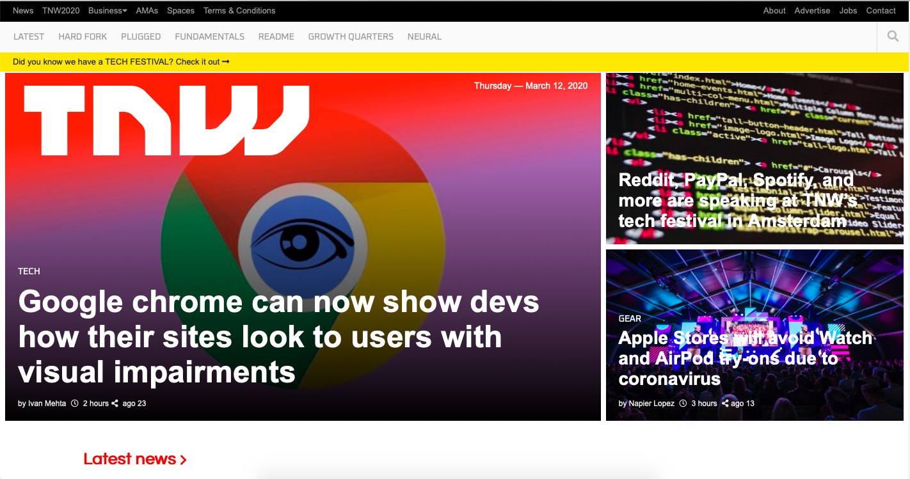

# Responsive Design [Collaborative project]
This site illutrates responsive design applied to a variety of screen sizes by using media queries
Additionally makes use of grid and flex design styles

> The structure of the index page (index.html) is based on the TheNextWeb.com main page

The structure of the index page is based on the TheNextWeb.com main page

## Built With

- HTML,
- CSS,
- Media query
- Font Awesome
- Google Fonts

## Live Demo

[Live Demo Link]()

## Getting Started

To get a local copy up and running follow these simple example steps.

### Prerequisites

#### You should have installed git on your local machine and a text editor preferably VS Code.

### Setup

#### Clone the repository into your local machine.

## 👤 Authors

### Author1
## Odong Sunday

- Github: [@OdongAlican](https://github.com/OdongAlican)
- Twitter: [@odongsandie](https://twitter.com/odongsandie)
- Linkedin: [Odong Sunday](https://www.linkedin.com/in/sunday-alican-odong-b99226b7/)

### Author2
## Ioannis Kousis

- Github: [@ioanniskousis](https://github.com/ioanniskousis)
- Twitter: [@ioanniskousis](https://twitter.com/ioanniskousis)
- Linkedin: [Ioannis Kousis](https://www.linkedin.com/in/ioannis-kousis-9a5051b4/)

## 🤝 Contributing

Contributions, issues and feature requests are welcome!

Feel free to check the [issues page](issues/).

## Show your support

Give a ⭐️ if you like this project!

## Acknowledgments

- Appreciation to my coding Partner John Ioannis Kousis and my mentor

## 📝 License

This project is [MIT](lic.url) licensed.
